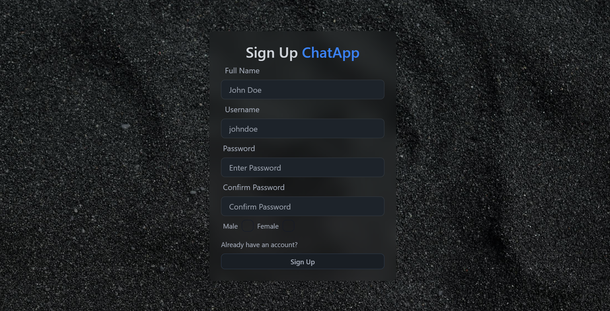
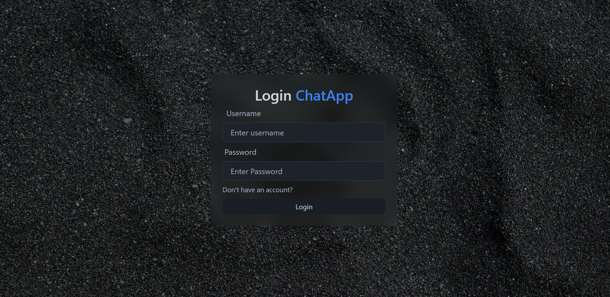
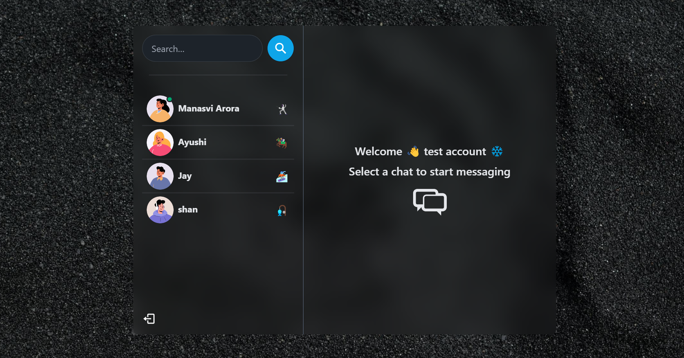
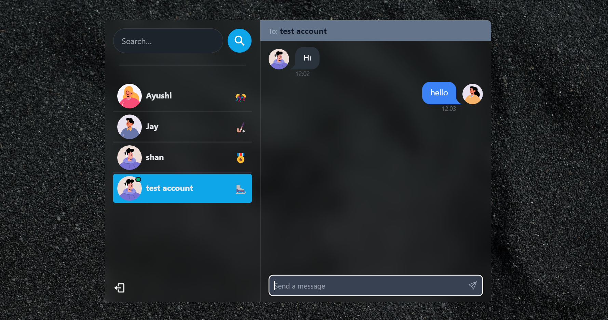
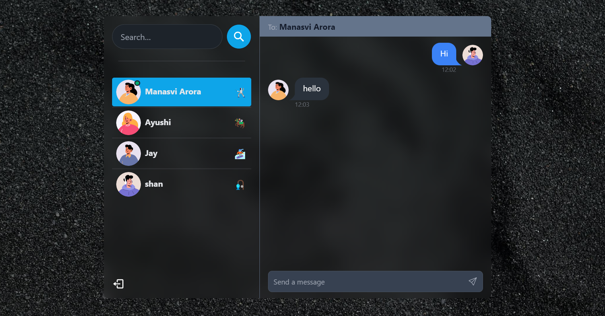

# Chat Application (MERN Stack)

This is a real-time chat application built using the MERN (MongoDB, Express, React, Node.js) stack. It uses **Socket.IO** for real-time communication and **JWT (JSON Web Tokens)** for user authentication.

## Features

- Real-time messaging with Socket.IO
- Shows which user is online
- User authentication with JWT
- MongoDB for storing user data
- Express and Node.js as the backend
- React for the frontend

## Live Hosting

    https://chatapp-s4bo.onrender.com/

## Prerequisites

Before you begin, ensure you have met the following requirements:

- Node.js and npm installed on your machine
- MongoDB installed and running

## Getting Started

Follow the steps below to get a local copy of the project up and running.

### 1. Clone the repository

```sh
git https://github.com/manasvi-tech/ChatApp.git
```
### 2. To build the application
```sh
npm run build
```
### 3. To start the application
```sh
npm start
```
### 4. Environment Variables

You can create a .env file in the root directory to store these variables.

```sh
PORT = 
MONGO_DB_URI =
JWT_SECRET = 
NODE_ENV = 
```
## Usage

- Once the server is running, open your browser and navigate to http://localhost:5000. You can now register, log in, and start chatting in real-time.

# Built With

- [Node.js](https://nodejs.org/en/) - JavaScript runtime
- [Express](https://expressjs.com/) - Web framework
- [MongoDB](https://www.mongodb.com/) - Database
- [Mongoose](https://mongoosejs.com/) - MongoDB object modeling tool
- [Handlebars](https://handlebarsjs.com/) - Templating engine

## Extra Packages Used

- `dotenv` - Loads environment variables from a `.env` file into `process.env`
- `bcrypt` - Library for hashing passwords
- `cookie-parser` - Middleware to parse cookies
- `jsonwebtoken` - Library to work with JSON Web Tokens
- `method-override` - Middleware to use HTTP verbs such as PUT or DELETE in places where the client doesn't support it

## Folder Structure

```
ChatApp
├── backend
│   ├── controllers
│   │   ├── auth.controller.js
│   │   ├── message.controller.js
│   │   └── user.controller.js
│   ├── db
│   │   └── connect.js
│   ├── middleware
│   │   └── protectRoute.js
│   ├── models
│   │   ├── conversation.model.js
│   │   ├── message.model.js
│   │   └── user.model.js
│   ├── routes
│   │   ├── auth.routes.js
│   │   ├── message.routes.js
│   │   └── user.routes.js
│   ├── socket
│   │   └── socket.js
│   ├── utils
│   │   └── generateToken.js
│   └── server.js
├── frontend
│   ├── dist
│   │   ├── assets
│   │   │   └── notification.mp3
│   │   └── index.html
│   ├── node_modules
│   ├── public
│   ├── src
│   │   ├── assets
│   │   │   └── sounds
│   │   │       └── notification.mp3
│   │   ├── components
│   │   │   ├── messages
│   │   │   │   ├── Message.jsx
│   │   │   │   ├── Messages.jsx
│   │   │   │   ├── MessageInput.jsx
│   │   │   │   └── MessageContainer.jsx
│   │   │   ├── sidebar
│   │   │   │   ├── Conversation.jsx
│   │   │   │   ├── Conversations.jsx
│   │   │   │   ├── Logout.jsx
│   │   │   │   ├── SearchInput.jsx
│   │   │   │   └── Sidebar.jsx
│   │   │   └── skeleton
│   │   │       └── MessageSkeleton.jsx
│   │   ├── context 
│   │   │   ├── AuthContext.jsx
│   │   │   └── SocketContext.jsx
│   │   ├── hooks
│   │   │   ├── UseGetConversation.js
│   │   │   ├── UseGetMessages.js
│   │   │   ├── UseListenMessages.js
│   │   │   ├── UseLogin.js
│   │   │   ├── UseLogout.js
│   │   │   ├── UseSendMessages.js
│   │   │   └── UseSignup.js
│   │   ├── pages
│   │   │   ├── home
│   │   │   │   └── Home.jsx
│   │   │   ├── login
│   │   │   │   └── Login.jsx
│   │   │   └── signup
│   │   │       └── Signup.jsx
│   │   ├── utils
│   │   │   ├── extractTime.js
│   │   │   └── emojis.js
│   │   ├── zustand
│   │   │   └── useConversation.js
│   │   ├── App.css
│   │   ├── App.jsx
│   │   ├── main.jsx
│   │   └── index.css
│   ├── index.html
│   ├── package.json
│   └── tailwind.config.js
├── package.json
└── package-lock
```
## Demo

### Signup Page



### Login Page



### Home Page



### Selected Conversation




